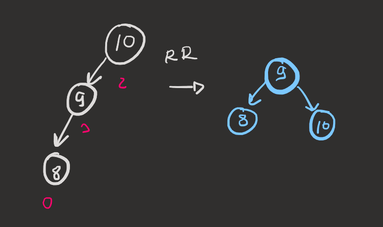
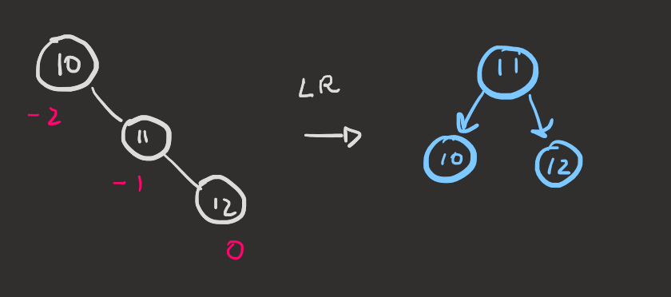
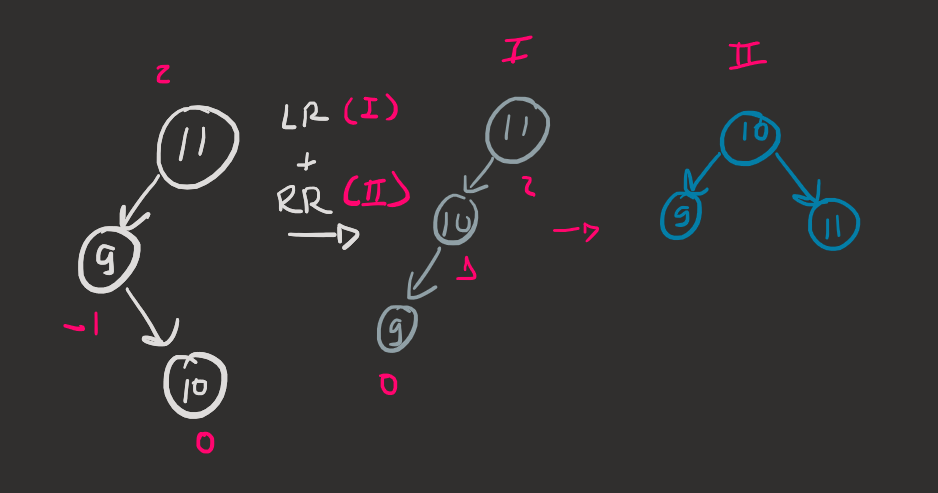
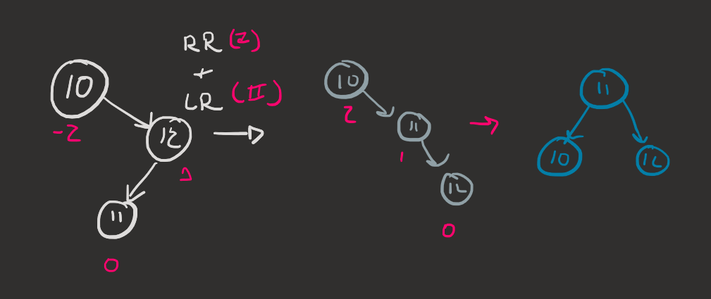

# AVL Trees

```
Output:

Inserting values: 10, 5, 15, 3, 7, 12, 20

=== Tree Structure ===
└── 10 (bf:0)
    ├── 15 (bf:0)
    │   ├── 20 (bf:0)
    │   └── 12 (bf:0)
    └── 5 (bf:0)
        ├── 7 (bf:0)
        └── 3 (bf:0)
=====================

Adding 1, 2 (forces rotations):

=== Tree Structure ===
└── 10 (bf:1)
    ├── 15 (bf:0)
    │   ├── 20 (bf:0)
    │   └── 12 (bf:0)
    └── 5 (bf:1)
        ├── 7 (bf:0)
        └── 2 (bf:0)
            ├── 3 (bf:0)
            └── 1 (bf:0)
=====================

Tree saved as balanced_tree_before_removal.dot
Tree after removing element 10 (root)

=== Tree Structure ===
└── 12 (bf:1)
    ├── 15 (bf:-1)
    │   └── 20 (bf:0)
    └── 5 (bf:1)
        ├── 7 (bf:0)
        └── 2 (bf:0)
            ├── 3 (bf:0)
            └── 1 (bf:0)
```

## Traversal and Other Algorithms

Please refer to the [BST (Binary Search Tree) README](../Binary%20Search%20Tree/README.md) to find detailed comments and explanations on common tree algorithms such as:

- **Tree Traversals**: In-order, Pre-order, Post-order, and Level-order traversal
- **Tree Properties**: Height calculation, balance factor computation
- **Basic Operations**: Search, insertion (iterative approach)
- **Tree Balancing**: Manual tree balancing using sorted array reconstruction
- **Node Removal**: Standard BST deletion with all cases (leaf, single child, two children)

These algorithms form the foundation for understanding tree data structures. AVL trees extend these basic operations by adding automatic balancing through rotations after each insertion and deletion to maintain the AVL property (|balance factor| ≤ 1 for all nodes).

**Key Difference**: While BST operations can result in unbalanced trees with O(n) worst-case performance, AVL trees guarantee O(log n) performance by maintaining balance through rotations.

## AVL Tree Operations

AVL trees are used to maintain balanced trees. After each insertion or deletion, we check if there are **unbalanced nodes** in the tree, performing the specific rotation for each case of unbalancing to ensure the tree stays balanced.

Rotations can be:
- **Simple**: Right Rotation & Left Rotation
- **Double**: Right-Left Rotation & Left-Right Rotation

Double rotations use simple rotations in different order (right-left or left-right).

**Balanced Tree**: Offers worst case O(log n) search time complexity. Unbalanced trees can degrade to O(n) worst case (similar to arrays).

**Balance Factor Formula:**
$$Balance\ Factor = Left\ Subtree\ Height - Right\ Subtree\ Height$$

**Unbalanced nodes:** |Balance Factor| > 1

## Rotation Cases

### Simple Right Rotation (LL Case)

We use simple right rotation when the left subtree is left-heavy. The node to be rotated has a positive balance factor and is unbalanced (BF > 1), and its left child also has a non-negative balance factor (BF ≥ 0).

**Condition:** `node->bf > 1 && node->left->bf >= 0`



**Steps for right rotation:**
1. Store the left child as pivot
2. Move pivot's right subtree to become the left subtree of the unbalanced node
3. Set the unbalanced node as the right child of pivot
4. Update heights for both nodes
5. Return pivot as the new root of this subtree

```cpp
Node* rotateRight(Node* node){
    Node* pivot = node->left;           
    node->left = pivot->right;          
    pivot->right = node;                
    
    updateHeight(node);
    updateHeight(pivot);
    
    return pivot;                      
}
```

### Simple Left Rotation (RR Case)

We use simple left rotation when the right subtree is right-heavy. The node to be rotated has a negative balance factor and is unbalanced (BF < -1), and its right child also has a non-positive balance factor (BF ≤ 0).

**Condition:** `node->bf < -1 && node->right->bf <= 0`



**Steps for left rotation:**
1. Store the right child as pivot
2. Move pivot's left subtree to become the right subtree of the unbalanced node
3. Set the unbalanced node as the left child of pivot
4. Update heights for both nodes
5. Return pivot as the new root of this subtree

```cpp
Node* rotateLeft(Node*node){
    Node*pivot = node->right;
    node->right = pivot->left;
    pivot->left = node;

    updateHeight(node);
    updateHeight(pivot);
    return pivot;
}
```

### Double Left-Right Rotation (LR Case)

Left-Right double rotation is performed when the left subtree is heavy (BF > 1) and the left child has a negative balance factor (BF < 0), creating a "zig-zag" pattern.

**Condition:** `node->bf > 1 && node->left->bf < 0`



This double rotation is performed by:
1. Apply Simple Left Rotation at the unbalanced node's left child
2. Apply Simple Right Rotation at the unbalanced node

```cpp
Node* rotateLeftRight(Node*node){
    node->left = rotateLeft(node->left);
    return rotateRight(node);
}
```

### Double Right-Left Rotation (RL Case)

Right-Left double rotation is performed when the right subtree is heavy (BF < -1) and the right child has a positive balance factor (BF > 0), creating a "zig-zag" pattern.

**Condition:** `node->bf < -1 && node->right->bf > 0`



This double rotation is performed by:
1. Apply Simple Right Rotation at the unbalanced node's right child
2. Apply Simple Left Rotation at the unbalanced node

```cpp
Node* rotateRightLeft(Node*node){
    node->right = rotateRight(node->right);
    return rotateLeft(node);
}
```

## Complete Rotation Logic

```cpp
// After updating height and calculating balance factor
if (abs(node->bf) <= 1) return node; 

// Left heavy cases
if(node->bf > 1) {
    if (node->left->bf >= 0) 
        node = rotateRight(node);           // LL case
    else 
        node = rotateLeftRight(node);       // LR case
}
// Right heavy cases
else if(node->bf < -1){
    if(node->right->bf <= 0) 
        node = rotateLeft(node);            // RR case
    else 
        node = rotateRightLeft(node);       // RL case
}

return node;
```

**Helper function for Balancing Tree:**
```cpp
int getHeight(Node*node){
        if(node == nullptr) return 0;
        int left_height = getHeight(node->left);
        int right_height = getHeight(node->right);
        return (max(left_height, right_height) + 1);
    }

    int getBalanceFactor(Node*node){
        if(node == nullptr) return 0;
        int left_subtree_height = this->getHeight(node->left);
        int right_subtree_height = this->getHeight(node->right);

        node->lh = left_subtree_height;
        node->rh = right_subtree_height;

        return (left_subtree_height - right_subtree_height);
    }
    
    void updateHeight(Node*node){
        node->bf = this->getBalanceFactor(node);
        return;
    }
```


### Removal

After node removal, the logic for balancing nodes are applied as well. The removal process follows standard BST deletion but includes AVL rebalancing.

```cpp
Node* removeElement(Node* node, int value){
    // Base case: node not found
    if(node == nullptr) return nullptr;
    
    // Search for the node to delete
    if(value < node->value){
        node->left = removeElement(node->left, value);
    }
    else if(value > node->value){
        node->right = removeElement(node->right, value);
    }
    else {
        // Node to be deleted found
        
        // Case 1: Node has no children (leaf)
        if(node->left == nullptr && node->right == nullptr){
            delete node;
            return nullptr;
        }
        
        // Case 2: Node has only right child
        else if(node->left == nullptr){
            Node* temp = node->right;
            delete node;
            return temp;
        }
        
        // Case 3: Node has only left child
        else if(node->right == nullptr){
            Node* temp = node->left;
            delete node;
            return temp;
            
        }
        
        // Case 4: Node has both children
        else {
            // Find inorder successor (leftmost node in right subtree)
            Node* successor = findMin(node->right);
            
            // Replace node's value with successor's value
            node->value = successor->value;
            
            // Delete the successor (which has at most one child)
            node->right = removeElement(node->right, successor->value);
        }
    }
    
    // AVL REBALANCING AFTER DELETION
    updateHeight(node);
    
    // Check if rebalancing is needed
    if(abs(node->bf) <= 1) return node;
    
    // Left heavy cases
    if(node->bf > 1) {
        if (node->left->bf >= 0) 
            node = rotateRight(node);           // LL case
        else 
            node = rotateLeftRight(node);       // LR case
    }
    // Right heavy cases
    else if(node->bf < -1){
        if(node->right->bf <= 0) 
            node = rotateLeft(node);            // RR case
        else 
            node = rotateRightLeft(node);       // RL case
    }
    
    return node;
}
```

**Helper function for finding minimum:**
```cpp
Node* findMin(Node* node){
    while(node->left != nullptr){
        node = node->left;
    }
    return node;
}
```

**Key points about AVL deletion:**
- Standard BST deletion is performed first
- After deletion, heights are updated
- Balance factors are checked and rotations are applied if needed
- The same rotation logic used in insertion is applied after deletion
- This ensures the tree remains balanced with O(log n) height
